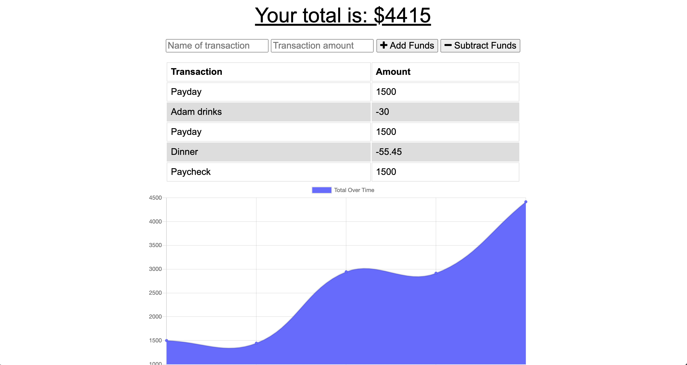

# Progressive Budget Tracker 

Have you ever needed to use a website but didn't have internet for some reason? Or have you ever wanted to download an app to your computer, but couldn't find it in the app store? I have! Before I even learned about progressive web applications (PWA's), I was utilizing them on a daily basis. I had added multiple web applications to my phone and desktop without even thinking about, turns out, adding this functionality has huge advantages for the end user.

My job for this budget tracking app was to take a fully functional web application and update it to make it a PWA. I wanted the user to be able to access any information they needed from it even if they didn't have internet. This application achieves offline functionality by utilizing Service Workers and the Cache API to store static files and API responses in the users local cache. Allowing users to access "older" information through the cached data while giving them the ability to add expenses or deposits and store them on the indexedDB on the browser. Once internet access is established, those "pending" transactions are sent to the online mongoDB in a bulk push and the local cache is cleared out. 

## Table of Contents
* [Technologies](#technologies)
* [Usage](#usage)
* [Finished Product](#finished-product)
* [Questions](#questions)

## Technologies
* HTML
* CSS
* JavaScript
* Node.js
* Express.js
* MongoDB
* Mongoose
* IndexedDB
* Service Workers
* Cache API

## Usage
* Navigate to the [deployed Heroku App](https://ng-pwa-budget-tracker.herokuapp.com/).
* Enter a transaction name and amount, choose whether the transaction is a deposit (add funds) or an expense (subtract funds).
* View a table containing past transactions.
* View a chart that tracks your total budget over time.
* While offline you may continue to view the application and add transactions. (Some features aren't fully working yet)
* When internet is detected, your total budget will update based on those transactions.
* To test offline capabilities either:
    * Turn your wifi off or 
    * Open your browsers' Dev Tools --> Application --> Service Workers --> Check the "Offline" box.

## Finished Product
View deployed Heroku app [here](https://ng-pwa-budget-tracker.herokuapp.com/).

## Questions
​
If you have any questions about the repo, please contact me:

On GitHub: [ngoudeau2012](https://github.com/ngoudeau2012) | Via Email: ngoudeau2012@gmail.com